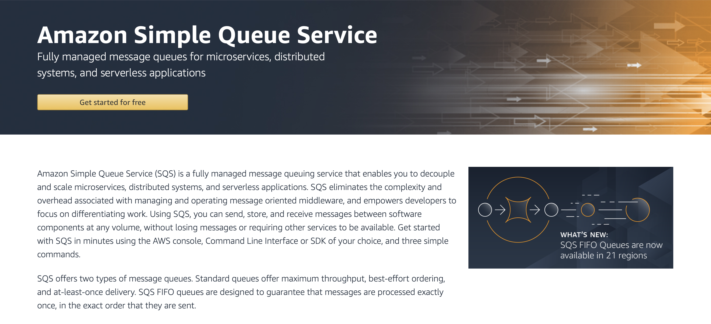

# AWS SQS Send messages

In this example we will show you how to send messages to an SQS Queue with a NodeJS lambda function

## Quickstart

1. **Install Serverless:**

[Install Serverless](../../README.md)

2. **Install NPM dependencies**
```Bash
npm install
```
3. **Create a Queue on AWS**

[Create a SQS](https://eu-west-1.console.aws.amazon.com/sqs/home?region=eu-west-1) on AWS

Make sure that you create your queue in the correct location

4. **Change all the variables in the code**

In serverless.yml:

```YAML
iamRoleStatements:
    - Effect: "Allow"
      Action:
        - "sqs:SendMessage"
        - "sqs:GetQueueUrl"
        # Change down here -> Put ARN of your queue
      Resource: "arn:aws:sqs:${self:provider.region}:1234567890:request"
    - Effect: "Allow"
      Action:
        - "sqs:ListQueues"
        # Change down here -> Put base ARN of all your queues
      Resource: "arn:aws:sqs:${self:provider.region}:1234567890:*"
```

And in handler.js
```JS
export  function main(event, context, callback) {
  // Your queue URL -> Change here
  var queueUrl = 'https://sqs.eu-west-1.amazonaws.com/1234567890/queue';
  var params = {
    MessageBody: event.body,
    QueueUrl: queueUrl
  };
```

You can find all these informations on [AWS SQS](https://eu-west-1.console.aws.amazon.com/sqs/home)

5. **Serverless Deploy**

Run Serverless
```Bash
serverless deploy
``` 

---

Now just send a post request to the url that was outputed with the message that you want to send to the queue in the body


